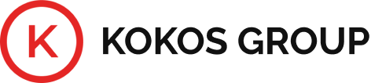
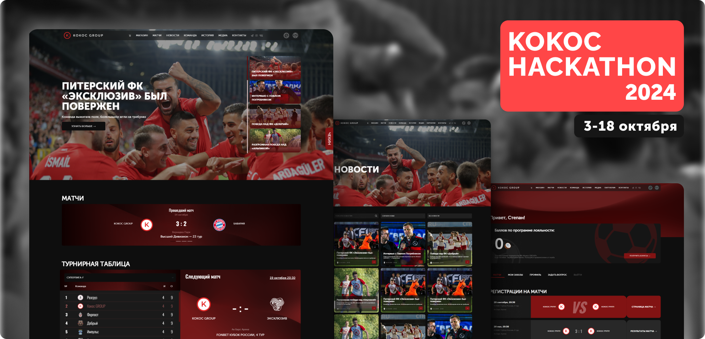

    

 

    

<h4 align="center">Команда "Swag"</h4>
🔗<b>Задача:</b> В рамках хакатона предстояло создать полнофункциональную веб-платформу, которая объединила бы футбольный клуб “Кокос Групп” и болельщиков между собой. 

    

    

    В репозитории представлена только верстка

# kokoc-group-soccer
